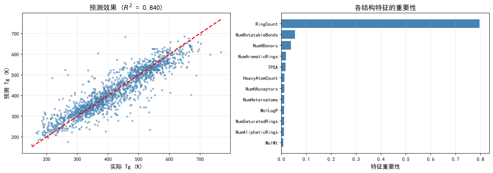

# 基于 RDKit 分子描述符和 XGBoost 的聚合物玻璃化转变温度（Tg）预测

**作者：Why**

使用机器学习方法，从聚合物的分子结构（PSMILES）预测其玻璃化转变温度（Tg）。

## 项目简介

本项目基于 **OpenPoly 实验聚合物数据库**，利用 **RDKit** 从聚合物的 PSMILES 分子结构表示中计算 **12 个分子描述符**，并使用 **XGBoost** 回归模型预测聚合物的玻璃化转变温度（`Tg_K`）。

模型通过 **GridSearchCV（5 折交叉验证）** 进行超参数调优，最终在测试集上取得 **R² = 0.840、MAE = 32.13 K** 的良好性能，并验证了环结构（`RingCount`）对 Tg 的决定性影响，与高分子物理理论一致。

## 数据说明

| 项目 | 说明 |
|------|------|
| **来源** | OpenPoly 实验聚合物数据库 |
| **原始样本** | 8471 个 |
| **剔除无效样本** | 2 个（PSMILES 无法被 RDKit 解析） |
| **有效样本** | 8469 个 |
| **目标变量** | `Tg_K`（玻璃化转变温度，单位 K） |
| **输入特征** | 从 PSMILES 计算得到的 12 个分子描述符 |

## 特征工程

使用 **RDKit** 计算以下 12 个分子描述符：

| 特征 | 中文含义 | 物理意义 |
|------|---------|----------|
| `MolWt` | 分子量 | 分子大小 |
| `HeavyAtomCount` | 重原子数 | 分子尺寸 |
| `NumRotatableBonds` | 可旋转键数 | 链柔性 |
| `NumHDonors` | 氢键供体数 | 分子间作用力 |
| `NumHAcceptors` | 氢键受体数 | 分子间作用力 |
| `NumAromaticRings` | 芳香环数 | 链刚性 |
| `NumSaturatedRings` | 饱和环数 | 链刚性 |
| `NumAliphaticRings` | 脂肪环数 | 链刚性 |
| `RingCount` | 环总数 | 链刚性 |
| `TPSA` | 极性表面积 | 极性、分子间作用 |
| `MolLogP` | 脂水分配系数 | 疏水性 |
| `NumHeteroatoms` | 杂原子数 | 极性、官能团 |

## 模型方法

- **算法**：XGBoost（梯度提升树回归）
- **调优方法**：GridSearchCV，5 折交叉验证，评分指标为 R²
- **数据划分**：训练集 68% / 验证集 12%（用于早停监控）/ 测试集 20%
- **早停机制**：基于独立验证集，`early_stopping_rounds=50`，避免过拟合并防止数据泄漏

### 最佳超参数

| 参数 | 值 |
|------|-----|
| `learning_rate` | 0.01 |
| `max_depth` | 7 |
| `n_estimators` | 1000 |
| `subsample` | 0.7 |

## 评估结果

### 5 折交叉验证（R²）

| 折数 | R² |
|------|-----|
| Fold 1 | 0.842 |
| Fold 2 | 0.836 |
| Fold 3 | 0.848 |
| Fold 4 | 0.840 |
| Fold 5 | 0.858 |
| **均值 ± 标准差** | **0.845 ± 0.008** |

### 测试集性能（最佳参数）

| 指标 | 数值 |
|------|------|
| **R²（决定系数）** | **0.840** |
| **MAE（平均绝对误差）** | **32.13 K** |
| **RMSE（均方根误差）** | **46.22 K** |

### 预测效果图



## 特征重要性分析

### Top 5 特征重要性

| 排名 | 特征 | 重要性 |
|------|------|--------|
| 1 | `RingCount`（环总数） | **0.796** |
| 2 | `NumRotatableBonds`（可旋转键数） | 0.055 |
| 3 | `NumHDonors`（氢键供体数） | 0.039 |
| 4 | `NumAromaticRings`（芳香环数） | 0.019 |
| 5 | `TPSA`（极性表面积） | 0.017 |

## 科学结论

**`RingCount`（环总数）是最重要的特征（重要性 0.796），远超其他所有描述符。**

环结构能够显著增加分子链的刚性，限制链段的自由运动，从而提高聚合物的玻璃化转变温度（Tg）。这与高分子物理中"链刚性是决定 Tg 的核心因素"的理论完全一致。

此外，可旋转键数、氢键供体等次要特征也体现了链柔性与分子间作用力对 Tg 的贡献，验证了该模型的物理合理性。

## 如何运行

### 1. 环境准备（推荐 conda）

```bash
# 创建并激活环境（Python 3.8+）
conda create -n tg_pred python=3.13 -y
conda activate tg_pred

# 安装 RDKit（conda 官方推荐方式）
conda install -c conda-forge rdkit -y

# 安装其余依赖
pip install pandas numpy scikit-learn xgboost matplotlib openpyxl
```

### 2. 准备数据

将数据文件 `experiment_polymer_data.xlsx` 放入项目根目录。

### 3. 运行主程序

```bash
python Tg_Prediction_Project.py
```

运行后将在控制台输出评估结果与特征重要性，并在项目目录生成 `Tg_Prediction_Results.png` 预测效果图。

## 技术栈

- **Python** 3.13
- **pandas** / **numpy**：数据处理
- **RDKit**：分子描述符计算
- **scikit-learn**：模型评估、交叉验证、网格搜索
- **XGBoost**：梯度提升树回归模型
- **matplotlib**：数据可视化

## 项目结构

```
.
├── Tg_Prediction_Project.py    # 主程序（数据加载 → 特征工程 → 调优 → 训练 → 评估 → 可视化）
├── experiment_polymer_data.xlsx # OpenPoly 实验聚合物数据
├── README.md                   # 项目说明文档
├── Tg_Prediction_Results.png   # 预测效果图（运行后生成）
├── step1_load_data.py          # 数据加载探索脚本
├── step2_preprocess.py         # 数据处理与建模脚本
├── step3_molecular_descriptors.py # 分子描述符脚本
└── XGboost.py                  # 早期 XGBoost 脚本
```

## 项目状态

**已完成**

- [x] 数据加载与清洗
- [x] RDKit 分子描述符特征工程
- [x] XGBoost 模型训练
- [x] GridSearchCV 超参数调优
- [x] 5 折交叉验证评估
- [x] 特征重要性分析与科学结论
- [x] 结果可视化
